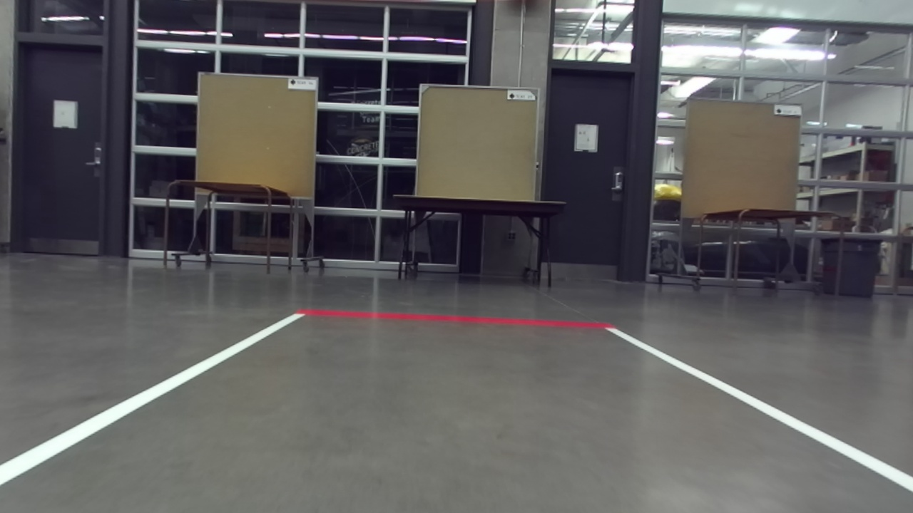
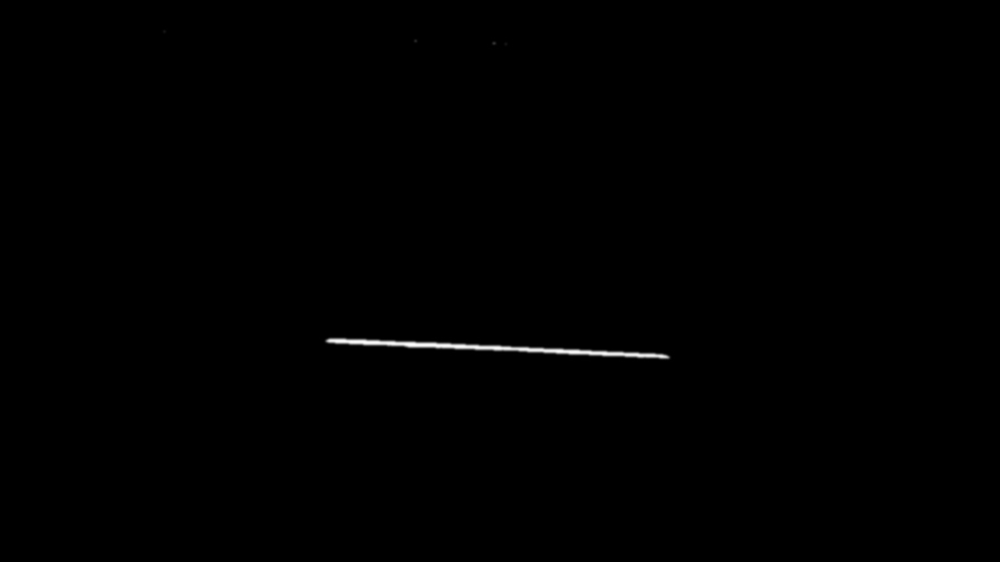
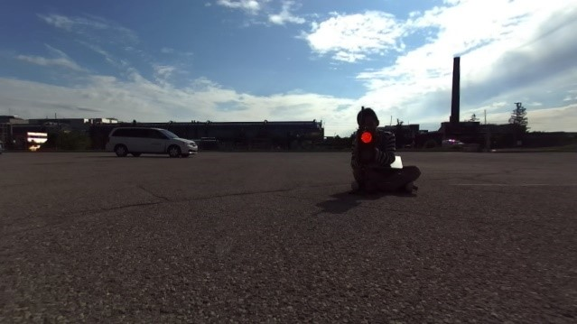
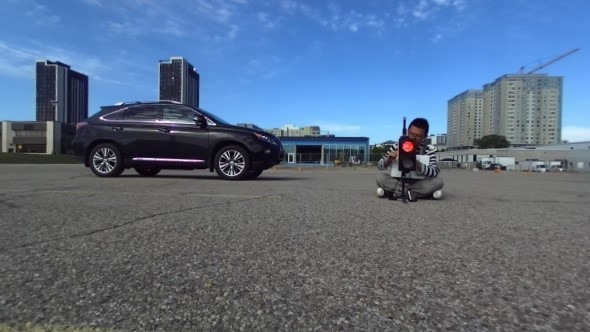
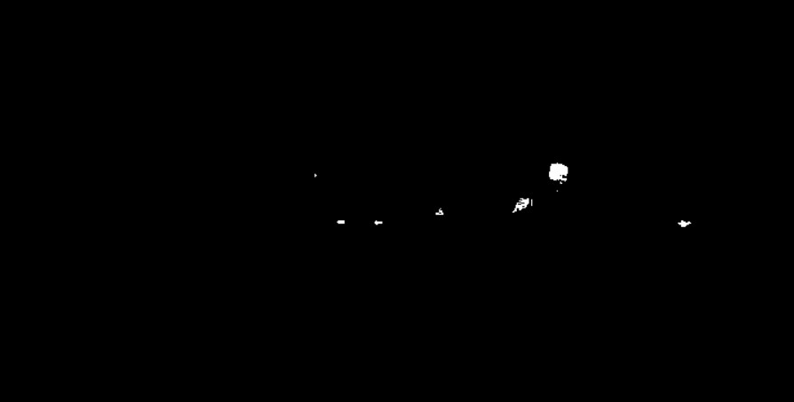

Computer Vision Node
=========

This node handles all the computer vision tasks required for the [IAARC 2019](https://iarrc.org/) competition, which involves traffic light, traffic sign, lane, and endline detection.

### Endline Detection
All the races indicate the ending of a lap with a distinct magenta line, which is what we refer to as the "endline". Our algorithm for detecting the endline is as follows: 

1. Apply colour thresholding with the bounds set to extract magenta in the HSV colour space. Read more about it [here](https://docs.opencv.org/3.4/da/d97/tutorial_threshold_inRange.html). The thresholding values were realized through testing the thresholding on a drag race setup in the E5 bay at night. Note that lighting conditions could very likely give different results that don't look as good. Below are some images showing the result of this step:

Original Image            |  Magenta Colour Threshold
:------------------------:|:-------------------------:
  |  
  |  

2. Extract contours from the thresholded image. Read more about it [here](https://docs.opencv.org/3.4/d4/d73/tutorial_py_contours_begin.html).

3. Sort contours by area and focus on the one with the largest area. We are assuming the contour with the largest area must be the endline. This is a pretty safe assumption in our case, the only way this backfires is if there is some large magenta object bigger than the endline in the robot's line of sight, which is unlikely.

4. For endline to be considered "detected", we must see 10 frames in a row with a max contour area above 1500. This number was picked by printing the contour areas to the terminal, and around the time the endline first comes into view, the area is around 1500. The 10 frame counter is to ensure no noisy frames trigger false positives.

5. Once endline is deteced, we now wait to see 10 frames in a row with a max contour area below 1500. Once this happens, a service call is made that is provided by the supervisor node, whose responsibility it is to then figure out what to do once the endline is gone. 

### Traffic light detection
All the races start when a traffic light turns from red to green. Our algorithm for detecting the change of traffic light is as follows:

1.	Extract the red light in each frame using color thresholding in the HSV color space. The thresholding values were specifically chosen based on testing on different Rosbags taken in the E7 parking lot during day time. It is important to notice that the results could vary under different lighting conditions. Below are two sets of images showing the result when facing and facing away from the sun:

Original Image                 |  Red Colour Threshold
:-----------------------------:|:----------------------------------:
  |  
  |  

2.	Find blobs in each frame by running blob detection algorithm. Read more about it here. By adjusting the parameters that blob detection uses, we can find all the blobs that are similar to a circle.
3.	Sort and find the largest blob. Based on testing the algorithm, we find that most of the time, the red light is the only blob that is detected and it is the largest blob. Therefore, it is safe to assume that the largest blob is the traffic light.  
4.	Fit a square around the blob found in previous step, calculate the non-zero-pixel ratio in the square, and set the ratio as default (normally around 99%). 
5.	Calculate the ratio on the same square for the next few frames and compare with the default value. If there are 10 frames that their ratio is larger than the default, we say “red light detected”. The 10 frames buffer is to ensure any noisy in a frame that may cause detection status change to “true”.
6.	Keep checking the ratio in each frame until there are 5 frames that the ratio is much smaller than the default. We say “green light detected”. The 5-frame buffer has the functionality as the 10-frame buffer. 
7.	Once the green light is detected, a service call is made that is provided by the supervisor node that then figures out what to do. The traffic light node is shut down at the end. 

