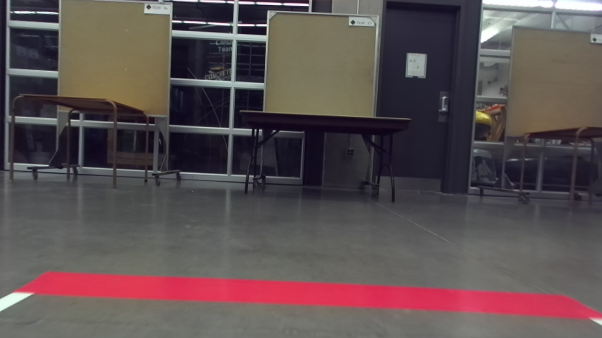
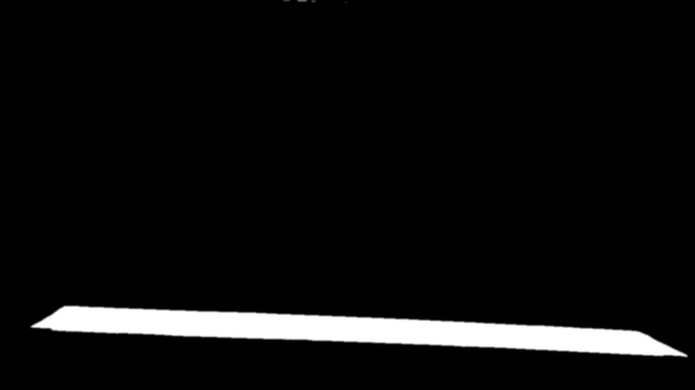
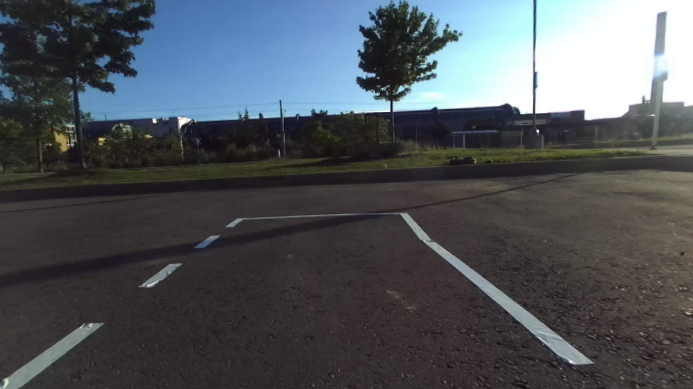
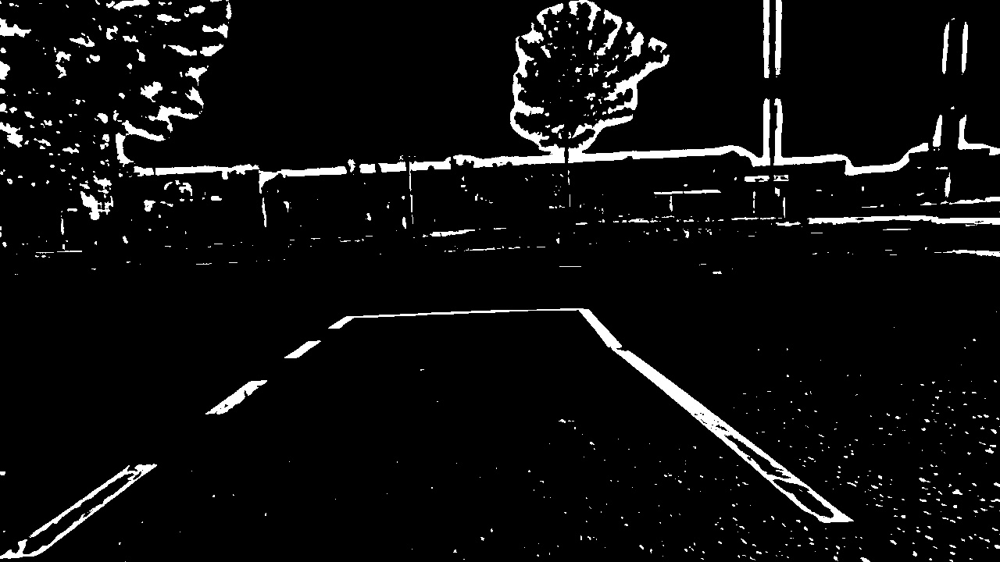
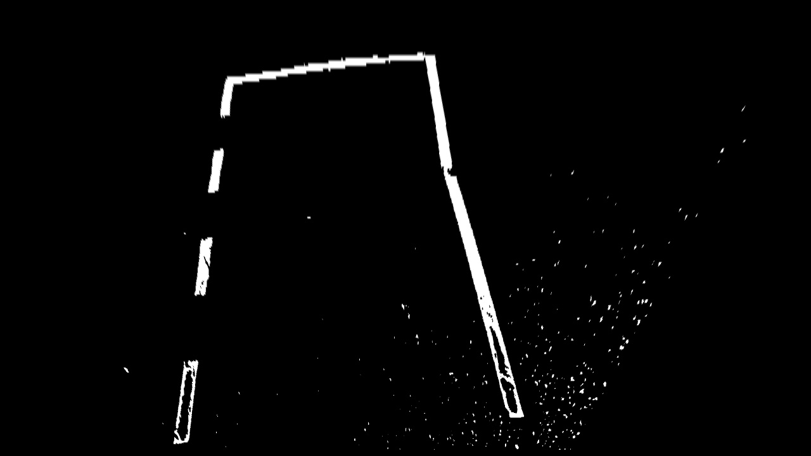
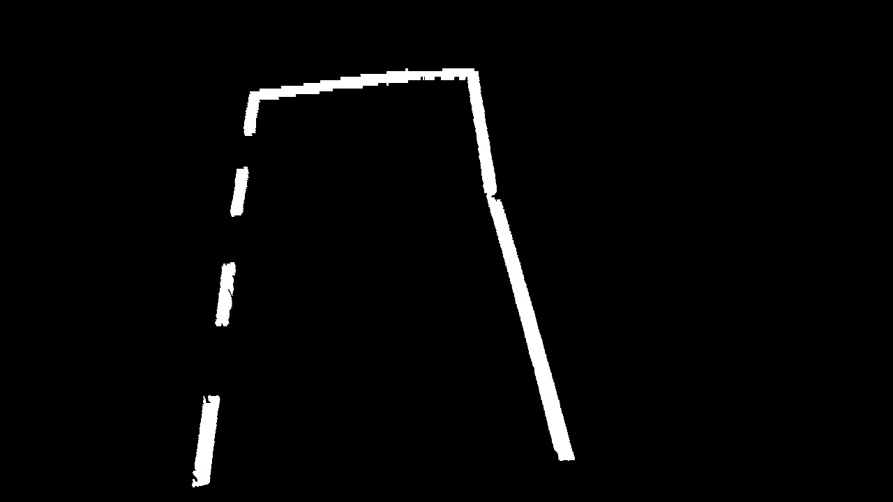

Computer Vision Node
=========

This node handles all the computer vision tasks required for the [IAARC 2019](https://iarrc.org/) competition, which involves traffic light, traffic sign, lane, and endline detection.

### Endline Detection
All the races indicate the ending of a lap with a distinct magenta line, which is what we refer to as the "endline". Our algorithm for detecting the endline is as follows: 

1. Apply colour thresholding with the bounds set to extract magenta in the HSV colour space. Read more about it [here](https://docs.opencv.org/3.4/da/d97/tutorial_threshold_inRange.html). The thresholding values were realized through testing the thresholding on a drag race setup in the E5 bay at night. Note that lighting conditions could very likely give different results that don't look as good. Below are some images showing the result of this step:

Original Image                              |  Magenta Colour Threshold
:------------------------------------------:|:------------------------------------------------:
  |  
  |  

2. Extract contours from the thresholded image. Read more about it [here](https://docs.opencv.org/3.4/d4/d73/tutorial_py_contours_begin.html).

3. Sort contours by area and focus on the one with the largest area. We are assuming the contour with the largest area must be the endline. This is a pretty safe assumption in our case, the only way this backfires is if there is some large magenta object bigger than the endline in the robot's line of sight, which is unlikely.

4. For endline to be considered "detected", we must see 10 frames in a row with a max contour area above 1500. This number was picked by printing the contour areas to the terminal, and around the time the endline first comes into view, the area is around 1500. The 10 frame counter is to ensure no noisy frames trigger false positives.

5. Once endline is deteced, we now wait to see 10 frames in a row with a max contour area below 1500. Once this happens, a service call is made that is provided by the supervisor node, whose responsibility it is to then figure out what to do once the endline is gone.

### Lane Detection
All the races have lane lines present, and need to be reliably detected with varying lane widths and lighting conditions. For the 2019 competition, the races have the following lane widths:

* Drag Race: 1.5m
* Circuit Race: 2m
* Obstacle Avoidance Challenge: 2m
* Urban Road Challenge: 1m

The lane detection algorithm is as follows:

1. Adaptive threshold on the value (V) channel in the HSV colour space
2. Warp transform to get a top-down view of the lanes
3. Contour filtering and filling to get rid of noise (rocks reflecting light on the ground, shadow outlines, etc.) as well as fill in any gaps that appear in the lanes

[comment]: <> (TODO: Show output on other races as well)
Original Image           |  1. Adaptive Threshold  | 2. Warp Transform       | 3. Contour Filtering
:-----------------------:|:-----------------------:|:-----------------------:|:-----------------------:
  |    |    |  
