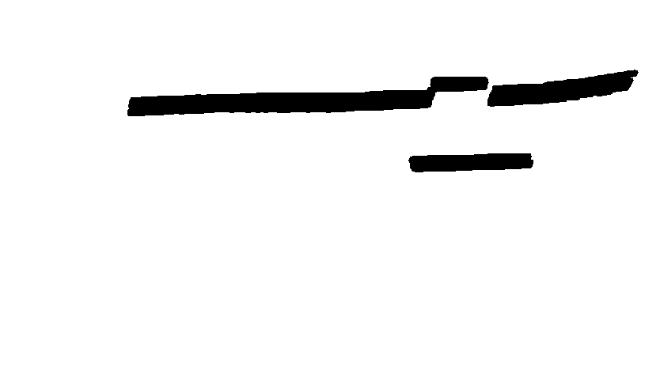

Computer Vision Node
=========

This node handles all the computer vision tasks required for the [IAARC 2019](https://iarrc.org/) competition, which involves traffic light, traffic sign, lane, and endline detection.

## Lane Detection
All the races have lane lines present, and need to be reliably detected with varying lane widths and lighting conditions. For the 2019 competition, the races have the following lane widths:

* Drag Race: 1.5m
* Circuit Race: 2m
* Obstacle Avoidance Challenge: 2m
* Urban Road Challenge: 1m

The lane detection algorithm is as follows:

1. Adaptive threshold on the value (V) channel in the HSV colour space.
2. Warp transform to get a top-down view of the lanes.
3. Contour filtering and filling to get rid of noise (rocks reflecting light on the ground, shadow outlines, etc.) as well as fill in any gaps that appear in the lanes.
4. Convert filtered image (binary) to an occupancy grid, which is the data type that the mapper uses. Each race has calibrated values fed into the meta data for the mapper to ensure the lane width on the occupancy grid matches real life. See the bottom left corner of the occupancy grid images to see the lane width on the occupancy grid.

Here are the results of this algorithm on the 3 varying lane widths. From top to bottom, it's: Urban road (1m), Drag race (1.5m), and Circuit race (2m). Notice that some contours can make it through the contour filter if it's something significant like an outline of a major shadow or a very bright object, however it's always clear inside the lanes, which is what really matters.

| Original Image | 1. Adaptive Threshold | 2. Warp Transform | 3. Contour Filtering | 4. Occupancy Grid |
| -------------- | --------------------- | ----------------- | -------------------- | ----------------- |
|  |  |  |  |  |
|  |  |  |  |  |
|  |  |  |  |  |

#### Horizontal Lane Detection
For the urban road challenge, we need to monitor the horizontal lanes located at the intersection in order to know when we can start performing our turns. We are also required to remove these lanes from the occupancy grid output as to not box in the path planner at the intersections. In order to accomplish this, the following algorithm was developed:
1. Dilate the warped and contour filtered binary image from step 3 above.
2. Apply the probabilistic Hough lines algorithm to this binary image. This algorithm returns a set of line segments defined each by a set of endpoints.
3. For each line, calculate it's angle. If the angle is within 30 degrees, this is deemed as a horizontal line. 
4. For each horizontal line, check if any of it's endpoints is within 30 pixels from the bottom of the image. If true, this means we are crossing the line soon and we will publish a "horizontal_lane_crossed" msg as true.
5. Each horizontal lane will have multiple horizontal line segments returned from the Hough lines so by setting each horizontal line segment thickness to 15 and adding it to a mask, we can cover the whole area used by the horizontal lanes in the mask.
6. Invert the mask and apply it to the input image to remove horizontal lanes. Convert this image to an occupancy grid and publish it.

| Original Image | Warped and Contour Filtered | Horizontal Hough Lines | Mask | Horizontal Lanes Removed |
| -------------- | --------------------- | ----------------- | -------------------- | ----------------- |
|  |  |  |  |  |

## Traffic Light Detection
The start of each race is indicated by a traffic light switching from red to green. Our algorithm for detecting the traffic light is as follows:

1. Colour thresholding in the HSV colourspace to extract reds from the image. Read more about it [here](https://docs.opencv.org/3.4/da/d97/tutorial_threshold_inRange.html). The thresholding values were specifically chosen based on testing on different rosbags taken in the E7 parking lot during the day time. It is important to notice that the results could vary under different lighting conditions. Below are two sets of images showing the result when facing towards and away from the sun:

| Original Image                                    |  Red Colour Threshold                          |
| ------------------------------------------------- | ---------------------------------------------- |
|  |  |
|  |  |

2. Find blobs in each frame by using OpenCV's blob detection algorithm. Read more about it [here](https://www.learnopencv.com/blob-detection-using-opencv-python-c/). The parameters in the algorithm are adjusted to catch blobs that look circular.

3. Sort and find the largest blob. Most of the time, the red light is the only blob that is detected and it is the largest blob. Therefore, it is safe to assume that the largest blob is coming from the traffic light.

4. Fit a bounding box around the blob found in the previous step, calculate the non-zero pixel ratio in the square, and set that as a reference ratio. 

5. Calculate the ratio on the same square for the next few frames and compare it to the reference value. Must see at least 10 frames in a row with a similar ratio before concluding that the red light has been detected. The 10 frame counter is to avoid false positives that could arise from noisy frames.

6. Keep checking the ratio in each frame until there are 5 frames in a row that give a ratio significantly smaller than the reference. This will happen when the red light turns off, at which point the green light comes on, and it is concluded that the green light has been detected.

7.	Once the green light is detected, a service call is made that is provided by the Supervisor node, which will figure out what to do next. The traffic light node shuts down after this service call is made.

## Endline Detection
All the races indicate the ending of a lap with a distinct magenta line, which is what we refer to as the "endline". Our algorithm for detecting the endline is as follows:

1. Apply colour thresholding with the bounds set to extract magenta in the HSV colour space. Read more about it [here](https://docs.opencv.org/3.4/da/d97/tutorial_threshold_inRange.html). The thresholding values were realized through testing on endline tape setup in various lighting conditions. Note that lighting conditions could very likely give different results that don't look as good. Below are some images showing the result of this step:

| Original Image                              |  Magenta Colour Threshold                |
| ------------------------------------------- | ---------------------------------------- |
|  |  |
|  |  |

2. Extract contours from the thresholded image. Read more about it [here](https://docs.opencv.org/3.4/d4/d73/tutorial_py_contours_begin.html).

3. Sort contours by area and focus on the one with the largest area. We are assuming the contour with the largest area must be the endline. This is a pretty safe assumption in our case, the only way this backfires is if there is some large magenta object bigger than the endline in the robot's line of sight, which is unlikely.

4. For endline to be considered "detected", we must see 10 frames in a row with a max contour area above 1500. This number was picked by printing the contour areas to the terminal, and around the time the endline first comes into view, the area is around 1500. The 10 frame counter is to ensure no noisy frames trigger false positives.

5. Once endline is deteced, we now wait to see 10 frames in a row with a max contour area below 1500. Once this happens, a service call is made that is provided by the supervisor node, whose responsibility it is to then figure out what to do once the endline is gone. 

### Sign Detection
For the urban challenge, an important part of the race is the detection and classification of the signs that will tell the robot where to go through an intersection. Using only the right rectified camera feed from our ZED Stereo Camera, we were able to get a robust sign detection and classification algorithm.

Before implementing our algorithm in ROS, we had to find a way to detect the sign from the camera input. We decided to train our own Haar Cascade classifier to detect these signs. The reasons for choosing a Haar Cascade over other more state-of-the-art techniques such as R-CNNs and Single Shot Detectors are as follows:
1. Haar cascades can evaluate images significantly faster than other CNN based methods on both CPU and GPU
2. A state-of-the-art CNN model was found to be unnecessary because of the simplicity of the object being detected and distinct Haar like features that could be found from them.

A custom training dataset was created by taking an existing traffic sign dataset, found [here](https://www.mapillary.com/dataset/vistas?pKey=cc5dEAyQECBFF9MN3MbdZA), and overlaying the given sign template over top with some random transformations applied to the sign, creating approximately 4000 positive images and 14000 negative images. The Haar Cascade was then trained using [OpenCV](https://docs.opencv.org/3.3.0/dc/d88/tutorial_traincascade.html)'s implementation over the span of 2 days for 14 stages.

With the trained Haar Cascade, our algorithm to acquire the arrow direction from ZED Camera images is as follows:
1. Apply the cascade to the input image to get a collection of bounding boxes that the classifier thinks are signs. In order to only get one sign as output we grab the bounding box with the highest certainty as output by the cascade.
2. To ensure our bounding box is in fact the sign and not a false positive, we ensure that we have been tracking this specific bounding box for a minimum of 10 consecutive frames. With the correct bounding box, we crop out this section of the image and feed it to our arrow classification algorithm.
3. The arrow classification algorithm starts by applying Canny edge detection to the sub-image and then applies a morphological closing operation to close any gaps in the Canny edges.
4. We then find all of the contours in the edge detection image and take the contour with the closest Euclidean distance to the center of the image. This can be assumed to be the arrow since the bounding box is centered around the sign.
5. Next, an ellipse is fit to the arrow contour in order to get an estimate of the arrow's center and orientation. If the orientation is vertical, we can conclude that the arrow is indicating us to go straight. If the orientation is horizontal, we can assume that the arrow is either indicating us to go left or right, and some further processing must be performed. In order to differentiate left from right, we start by finding a line that passes through the found ellipse's center and runs perpendicular to it's major axis.
6. From this line, we create two masks that split the arrow in half. One mask contains the arrow's head and one contains the arrow's base.
7. Finally, we can mask the arrow using both masks and count the number of pixels in both sections of the arrow. It can be assumed that the section of the arrow containing the head contains more pixels than the other section. We now know the orientation of the arrow head and can conclude if we need to turn left or right.

Example Haar Cascade output:

Original image | Haar cascade bounding box
:-------------:|:------------------------:
 | 

Example images for arrow classification algorithm:

Canny edge detection | Arrow contour | Fit ellipse and line | Masks used to split arrow
:-------------------:|:-------------:|:--------------------:|:-------------------------:
 |   |  |  

